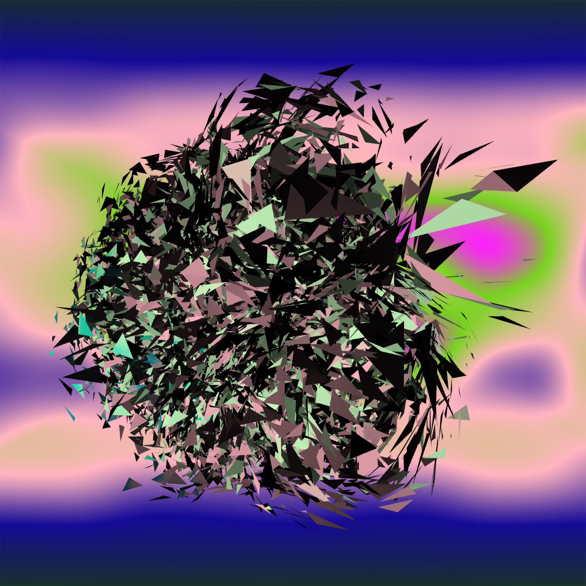

# Generative Conservation FA2

SmartPy FA2 contract for generative artworks on Tezos with on-chain
conservation records and generative behaviour parameters.

Author: Chiara Passa  
December 2025

## Example artwork

## Interaction demo

https://www.youtube.com/shorts/nrU4b1iR_uM

This project explores how blockchain infrastructure can support the
long-term preservation of generative and software‑based artworks, not
only recording ownership but also documenting the technical life and
behavioural parameters of an artwork over time.

The contract is written in SmartPy and targets the Tezos FA2 token
standard.

The contract extends a standard FA2 NFT model with structures designed
to record:

-   generative behaviour parameters
-   restoration events
-   canonical artifact versions
-   artist intent statements
-   authorized conservators

The goal is to create a framework where ownership, behaviour,
conservation, and documentation coexist on‑chain.

------------------------------------------------------------------------

WHY THIS PROJECT EXISTS

Generative and software‑based artworks evolve over time.

Browsers change, rendering engines are deprecated, dependencies break,
and exhibition contexts vary. Traditional NFT contracts typically record
ownership and transfer, but they rarely document how an artwork is
preserved or migrated technically.

This project introduces a conservation‑oriented layer around an FA2 NFT
contract that allows artworks to maintain a traceable preservation
history.

Examples of recorded events may include:

-   browser compatibility updates
-   migration from WebGL to WebGPU
-   conservation documentation
-   exhibition‑specific technical adjustments
-   archival snapshots of the artwork

The result is not just an NFT contract, but a framework for thinking
about digital art preservation on‑chain.

------------------------------------------------------------------------

EXAMPLE CONSERVATION WORKFLOW

1.  The artist mints an artwork token.
2.  The behaviour of the digital sculpture is defined by on‑chain
    parameters.
3.  The artwork is collected by a collector.
4.  A museum conservator is authorized.
5.  A migration is performed (for example WebGL → WebGPU).
6.  A migration report is uploaded to IPFS.
7.  The report CID is appended to the restoration log.
8.  The updated implementation is registered as a new canonical artifact
    version.

This creates a transparent conservation history for the artwork.

------------------------------------------------------------------------

CORE IDEAS

OWNERSHIP

Each token represents an artwork edition and has an owner. Tokens follow
the FA2 standard and can be transferred normally.

------------------------------------------------------------------------

GENERATIVE BEHAVIOUR PARAMETERS

Each token stores deterministic parameters that define the behaviour of
the generative sculpture.

These parameters are generated at mint time and stored on‑chain:

seed
mode
personalityA
personalityB
personalityC

The artwork viewer uses these parameters to determine the behaviour of
the digital sculpture, including variations in form, motion, and
interaction.

Because these parameters are recorded on‑chain, the behaviour of each
edition can always be reconstructed.

------------------------------------------------------------------------

RESTORATION LOG

Each token can accumulate a list of restoration records.

These records typically point to IPFS documents containing:

-   migration reports
-   conservation notes
-   technical snapshots
-   institutional documentation

------------------------------------------------------------------------

CANONICAL ARTIFACT VERSIONS

A token can maintain a list of canonical artifact implementations such
as:

-   WebGL implementation
-   WebGPU migration
-   browser compatibility update
-   exhibition‑specific restoration package

This allows future stewards to understand which implementation
represents the authoritative version of the artwork.

------------------------------------------------------------------------

ARTIST INTENT

The contract stores contract‑level intent data that clarifies the
conceptual boundaries of the work.

Examples include:

-   whether reinterpretation is acceptable
-   whether interactivity must be preserved
-   a CID linking to an artist intent statement
-   allowed migration types
-   forbidden actions

This information is particularly useful for archives, museums, and
future technical conservators.

------------------------------------------------------------------------

PERMISSIONS OVERVIEW

  Action                  Who can execute
  ----------------------- -------------------------------------
  Mint token              Administrator (artist)
  Transfer token          Owner
  Log restoration         Owner / Conservator / Administrator
  Add artifact version    Administrator
  Authorize conservator   Administrator
  Update artist intent    Administrator

------------------------------------------------------------------------

METADATA STRUCTURE

Example token metadata files are included in the repository.

Wallet addresses in this repository are replaced with placeholders such
as:

tz…Your Wallet

The deployed contract and minted tokens use the correct creator address.

Metadata typically includes:

-   artwork description
-   preview images
-   interactive viewer (animationUri)
-   royalty configuration
-   attributes for indexing
-   conservation references

Interactive artworks can be rendered through an external viewer linked
in the metadata.

------------------------------------------------------------------------

REPOSITORY STRUCTURE

generative-conservation-fa2/

contract/
  generative_conservation_fa2.py

metadata/
  canonical_artifact_v1.json
  contract_metadata.json
  token_0_metadata.json
  ...
  token_9_metadata.json

docs/
  architecture.md
  artist-intent.md
  usage.md

examples/
  ORED_token0_v2.0_webgpu.json

assets/
  architecture.png
  OODebris0.jpg
  OODebris2.jpg
  OODebris4.jpg
  OODebris7.jpg
  OODebris9.jpg
  o-debris-passa.mp4

LICENSE
README.md

------------------------------------------------------------------------

WHAT THE CONTRACT IMPLEMENTS

The FA2 contract prototype includes:

-   admin‑controlled minting
-   NFT ownership tracking
-   token transfers
-   generative parameter storage
-   authorized conservators
-   restoration logging
-   canonical artifact version registration
-   artist intent updates

The contract extends the FA2 model without breaking compatibility with
common Tezos NFT workflows.

------------------------------------------------------------------------

HOW TO USE THIS REPOSITORY

Open SmartPy

This contract was developed using the SmartPy online IDE:
https://smartpy.io/ide

Open the IDE and create a new project, or paste the contract code from
this repository into the editor.

Review the contract

Open the contract file:

contract/generative_conservation_fa2.py

This file contains the FA2 implementation together with the conservation
and generative behaviour logic.

Configure deployment

Before deployment update:

-   administrator wallet address
-   contract metadata URI
-   collection‑level metadata
-   token metadata generation workflow

Test in the SmartPy IDE

Use the SmartPy test scenario included in the contract to simulate:

-   minting tokens
-   generative behaviour parameter creation
-   restoration logs
-   artifact version updates
-   conservator permissions

Compile and deploy

Use the Compile button in the SmartPy IDE to generate the Michelson
contract.

Recommended workflow:

deploy first to Ghostnet
test minting and transfers
deploy to Tezos Mainnet when ready

Connect it to a website

For direct sales from your website:

-   keep the artwork token as FA2
-   add either a buy() entrypoint in the contract or a separate sale
    contract

Wallets such as Temple can be connected from the frontend through
Beacon.

------------------------------------------------------------------------

SUGGESTED USE CASES

This framework can support:

-   generative 1/1 artworks
-   museum acquisition records
-   software‑based art conservation
-   browser or engine migration tracking
-   preservation of artist intent
-   archival documentation linked to NFTs

------------------------------------------------------------------------

IMPORTANT NOTE

This repository is an artistic and research‑oriented prototype.

Before production use with significant economic value, the contract
should be carefully reviewed and audited. Particular attention should be
given to:

-   permission management
-   transfer logic
-   burn policy
-   token metadata format
-   marketplace compatibility
-   sale logic for direct website sales

------------------------------------------------------------------------

CONCEPTUAL FRAMING

A concise description of the project:

A blockchain‑assisted conservation framework for generative and
software‑based art on Tezos that links behaviour, ownership, and
preservation history.

------------------------------------------------------------------------

License

The code in this repository is released under the MIT License.

Artwork files, images, media assets, and generative works remain
© Chiara Passa 2025 and may not be reused without permission.
